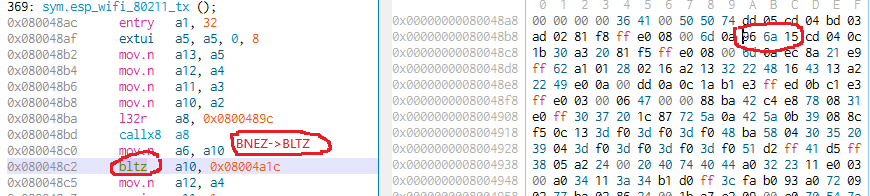

# ESP32 wifi tool

The goal of this repository is to create a WiFi explore tool for the self educated purpose.

## Source code features.
* Espressif/idf. (no arduino).
* C++/C mixed code.

I am sorry for sometimes ugly source code. I have got the result and I have no desire to do a source code refactoring.

## Main functions list:
1. Web page (ESP32 AP mode). 
    * download exploration results files
    * edit & upload configurations
2. AP scanner. 
3. Beacon spammer.
4. Wifi traffic sniffer & _optional_ pcap file PCAP_LINKTYPE_IEEE802_11(105).
5. Deauther packets traffic scanner.
6. Deauther sender (patched ieee80211_output.o).
7. NAT router & _optional_ pcap file PCAP_LINKTYPE_ETHERNET(1).

## Deauther packets traffic scanner
I had not know before how often a 'deauther' used for jamming the unwelcome WiFi APs in government's offices or a private company offices.

## Deauther sender
This sender created **only** for the self educated purpose. 

I investigate the reactions difference of various type STA/AP on a deauthentication packet.

## Nat router.
Based on the https://github.com/martin-ger lwip fork.

All IP traffic of ESP32 SoftAP can be saved in to PCAP file. 

This mode was created only for the self educated purpose. 
It's very useful to see what your phone try to send into the open WiFi network after connect.

# Some hardware design & menu screenshots
## Main menu & hardware design
![[photo]](./demo_images/photo0.jpg)
## Router submenu
![[photo]](./demo_images/photo1.jpg)
## Wifi sniffer submenu and working page
![[photo]](./demo_images/photo2.jpg)
![[photo]](./demo_images/photo3.jpg)

# Web page
* ESP32 AP default url: 192.168.4.1:80
* Demo/debug mode without ESP32: 
    * _./project/main/web/test_server.py_ - localhost web page test
    * _./project/main/web/sd_ - tests files

![[demo page ]](./demo_images/wp0.png)
![[demo page ]](./demo_images/wp1.png)
![[demo page ]](./demo_images/wp2.png)
![[demo page ]](./demo_images/wp3.png)
![[demo page ]](./demo_images/wp4.png)

# Requirements
* ESP32 module [ESP32_Espressif_ESP-WROOM-32_Dev_Board](https://commons.wikimedia.org/wiki/File:ESP32_Espressif_ESP-WROOM-32_Dev_Board.jpg)
* 1.44 TFT st7735 128x128
* SMD button switches 
* SD card (SPI mode).
## Wiring diagram (arduino primitive style)
For practical use case, ESP32 is working with a SD card without external SPI pins pull up.

![[wiring]](./demo_images/wiring.png)

# External dependencies
* Espressif bulding tools and IDF. [espressif/idf docker builder](https://hub.docker.com/r/espressif/idf)
* Fork of esp-lwIP with NAT feature. For 'router' mode. [github martin-ger/esp-lwip](https://github.com/martin-ger/esp-lwip)

## Useful things (optional)
* [Image to "C" code codenverter](https://littlevgl.com/image-to-c-array)
* [xtensa CPU object file editor (cutter v1.10)](https://github.com/radareorg/cutter/releases)

# Build & install.
1. Install latest docker image [espressif/idf](https://hub.docker.com/r/espressif/idf). _I used the 2b09259647b image_.
2. Do 'git clone https://github.com/martin-ger/esp-lwip.git' or download fork of esp-lwIP with NAT feature in to '$HOME/project/lwip_nat'  [github martin-ger/esp-lwip](https://github.com/martin-ger/esp-lwip)
3. Build project.
``` sh
docker run --rm -v $HOME/project:/project -w /project espressif/idf ./build_patched.sh
```
4. Upload ESP32 images into the ESP32 board.
``` cmd
esptool.py -p COM4 -b 460800 --before default_reset --after hard_reset --chip esp32  write_flash --flash_mode dio --flash_size detect --flash_freq 40m 0x1000 "m:/project/build/bootloader/bootloader.bin" 0x8000 "m:/project/build/partition_table/partition-table.bin" 0x10000 "m:/project/build/mm-test.bin"
``` 

# Windows 10 build.
## Install VM Linux:
1. Download & install [VM VirtualBox](https://www.virtualbox.org/wiki/Downloads)
2. Install ubuntu server image. [Ubuntu server](https://ubuntu.com/#download)
3. Run virtual ubuntu server

## Prepare VM Linux:
1. Install last [docker](https://docs.docker.com/install/linux/docker-ce/ubuntu/)
2. _Optional_ install [dperson samba](https://github.com/dperson/samba)

_samba anonymous login:_ 
``` sh
docker run -it --name samba -p 139:139 -p 445:445 -v /home/mm:/mount --name samba -e USERID=`id -u $USER` -e GROUPID=`id -g $USER` -d dperson/samba -s "public;/mount;yes;no;yes;all"
```
_login/password:_ 
``` sh
docker run -it --name samba -p 139:139 -p 445:445 -v /home/mm:/mount --name samba -e USERID=`id -u $USER` -e GROUPID=`id -g $USER` -d dperson/samba -u "$USER;$USER" -s "public;/mount;yes;no;no;$USER" 
```

## Windows upload command line
``` cmd
esptool.py -p COM4 -b 460800 --before default_reset --after hard_reset --chip esp32  write_flash --flash_mode dio --flash_size detect --flash_freq 40m 0x1000 "m:/project/build/bootloader/bootloader.bin" 0x8000 "m:/project/build/partition_table/partition-table.bin" 0x10000 "m:/project/build/mm-test.bin"
``` 

# Off-line docker setup.
1. [Download image](https://docs.docker.com/install/linux/docker-ce/ubuntu/#install-from-a-package)
2. Install 
``` sh
cat docker.gpg | sudo apt-key add -
sudo apt-key fingerprint 0EBFCD88
sudo dpkg -i docker-ce_19.03.5_3-0_ubuntu-bionic_amd64.deb 
sudo dpkg -i docker-ce-cli_19.03.5_3-0_ubuntu-bionic_amd64.deb 
sudo dpkg -i containerd.io_1.2.6-3_amd64.deb 
sudo /usr/sbin/service docker start
```
3. Validate installation
``` sh
sudo systemctl status docker.socket
sudo docker version
sudo docker info
sudo systemctl status docker.socket
docker images
docker pa -a
```

# _libnet80211.a/ieee80211_output.o_ analysis (&patch)
1. Install [xtensa CPU object file editor (cutter v1.10)](https://github.com/radareorg/cutter/releases)
2. Find & download xtensa.pdf
3. Get _ieee80211_output.o_ file from the espressif/idf docker image.
``` sh
rm -R $HOME/libnet80211_src
mkdir $HOME/libnet80211_src
docker run --rm --user=`id -u $USER`:`id -g $USER` -v $HOME/libnet80211_src:/project -w /project espressif/idf ar x /opt/esp/idf/components/esp_wifi/lib/esp32/libnet80211.a ieee80211_output.o
```
4. Do research work [xtensa CPU object file editor (cutter v1.10)](https://github.com/radareorg/cutter/releases)


